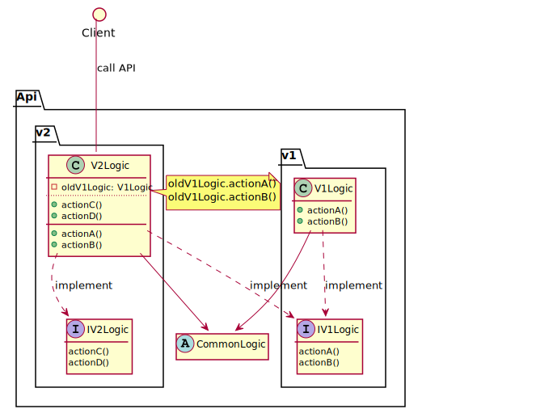

API Versioning
---

> Some resources:
> * [https://stackoverflow.com/questions/389169/best-practices-for-api-versioning](https://stackoverflow.com/questions/389169/best-practices-for-api-versioning)
> * [https://cloud.google.com/apis/design/versioning](https://cloud.google.com/apis/design/versioning)


# 1. Constrains

* The URI should not change over time
* The versioned URI should have litmitted time of life (expected to be expired)
* The expired version should return 301 moved permanently or 302 found or 410 gone with a warning in response header

# When to version

Definition of a breaking changes:

* [Microsoft](https://github.com/Microsoft/api-guidelines/blob/vNext/Guidelines.md#123-definition-of-a-breaking-change)


# 2. Approaches

## 2.1. Versioning in the URI segment - More practical

```
https://localhost.com/api/v2.0/customers/123
https://localhost.com/api/v1/customers/123
```

## 2.2. Versioning in the Accept header of request - More freedom

```
https://localhost.com/api/customers/123

==>
HTTP method: GET
Accept: application/json+v3

<==
HTTP/1.1 200 OK
Content-Type: application/json+v3
Body:
{
    "test":"test data"
}
```

## 2.3. Versioning in the query string - Pollute the parameter list

```
https://localhost.com/api/customers/123?version=1
```

# 3. Implementations

Inherit from a common abstract class for common logic. Use Proxy design pattern to proxy the call to the old version API.



<!--  -->